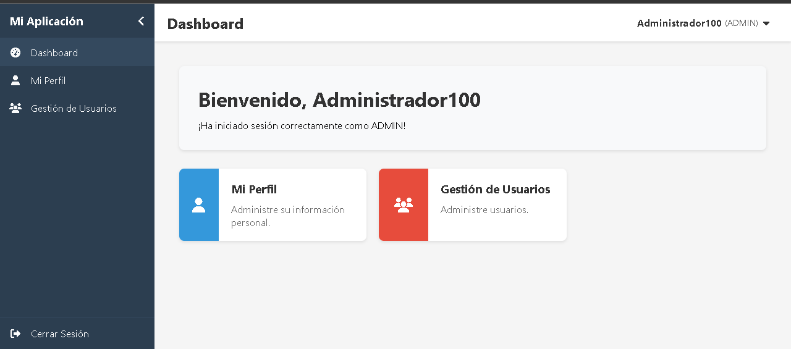
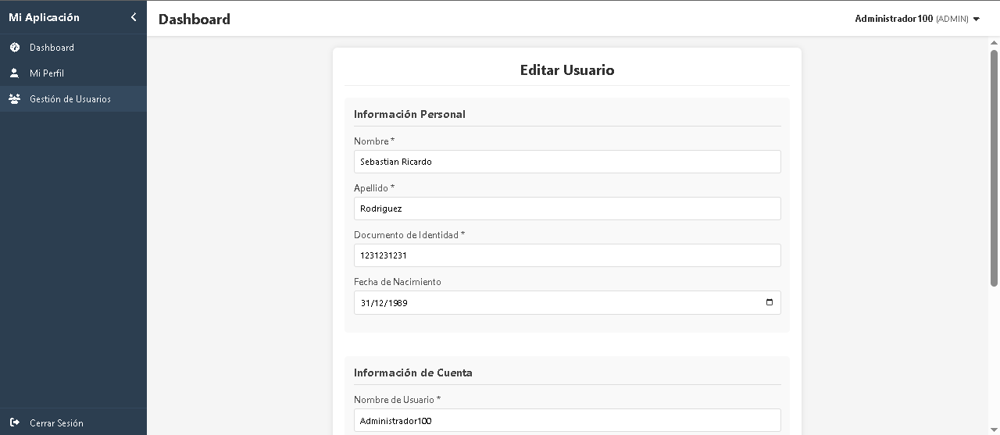
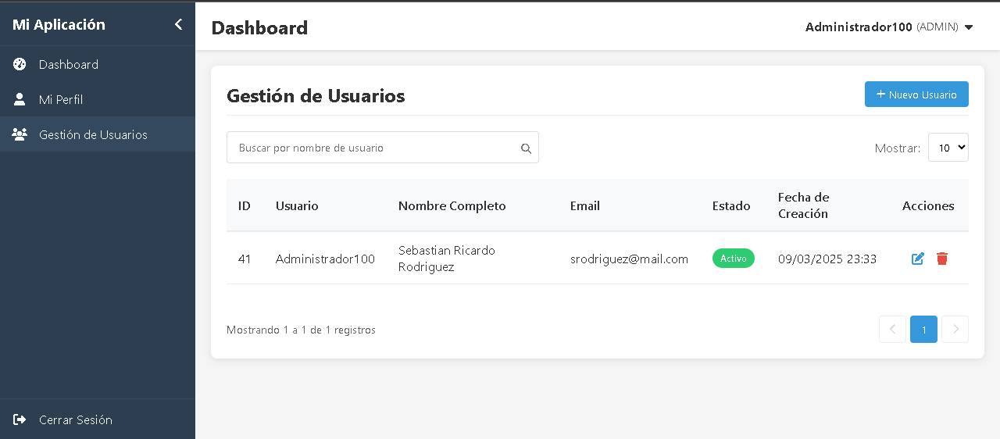
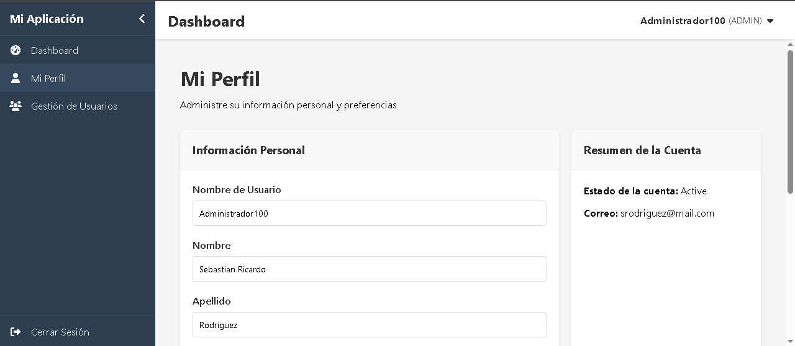
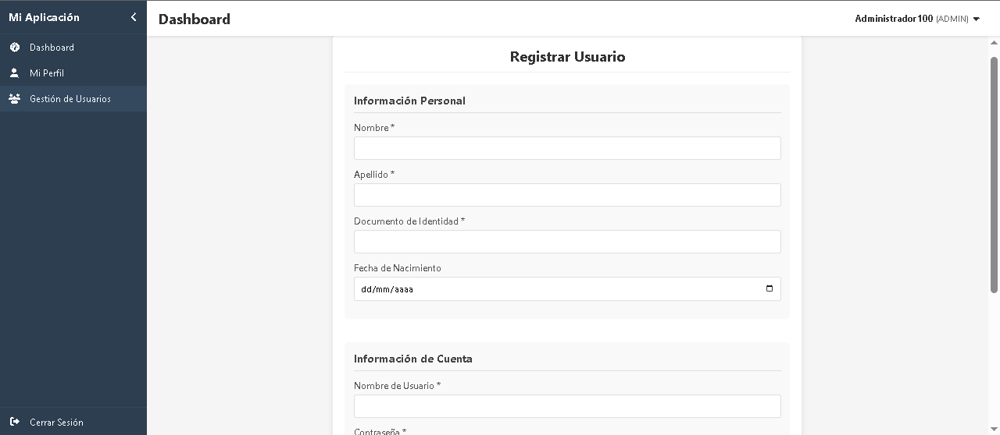
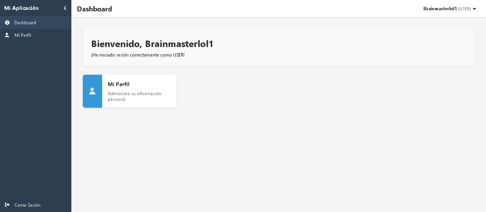
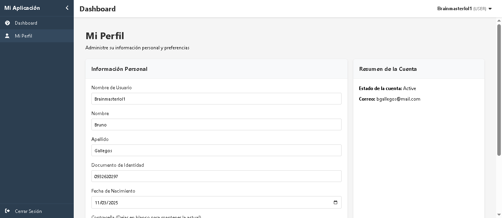

# LoginSystem

# Versiones
- Angular CLI: 19.2.0
- Node: 22.11.0
- Package Manager: npm 10.9.0
- .NET 8.0

# Desplegar sistema
1. Abrir el archivo SQLQuery LoginSystem y correr el script
2. Configurar la cadena de conexión appSettings.json con la dirección a la base creada
3. Verificar que el Issuer y el Audience son correctos
4. Ejecutar el back
5. Ejecutar el front
6. Iniciar sesión con las siguientes credenciales:
- Usuario: Administrador100
- Contraseña: Password!

# Capturas
## Usuario Admin

## Usuario User

